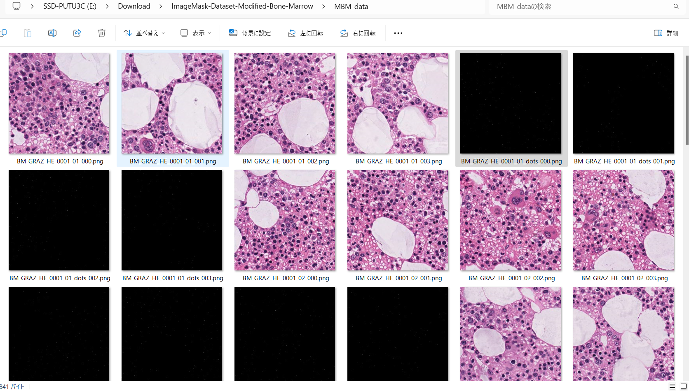
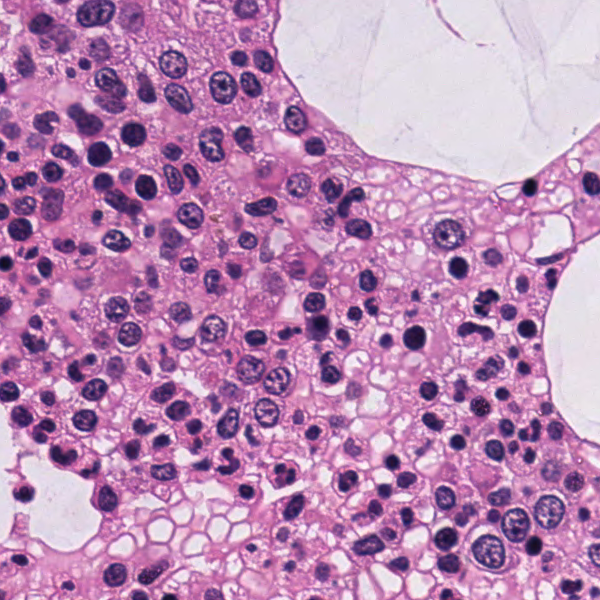
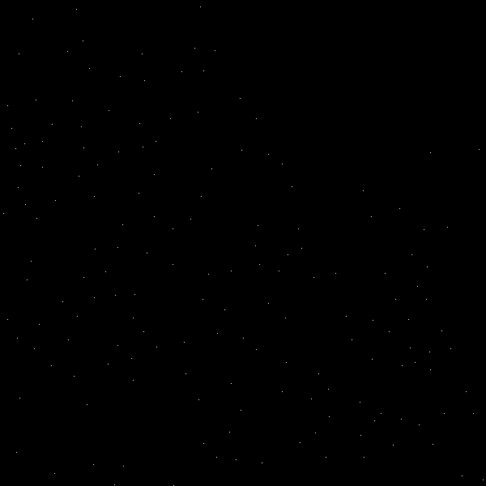
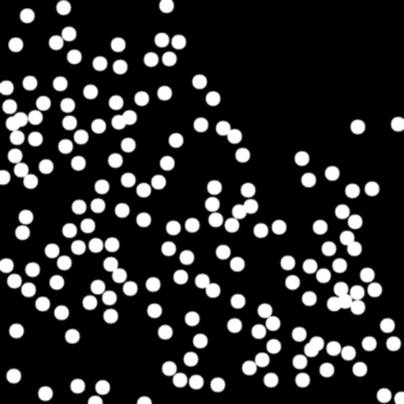
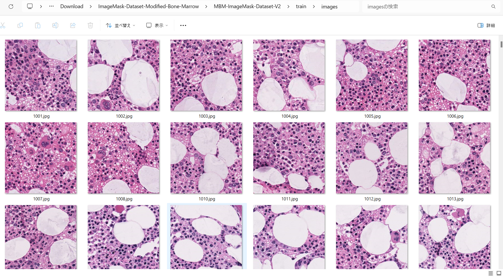
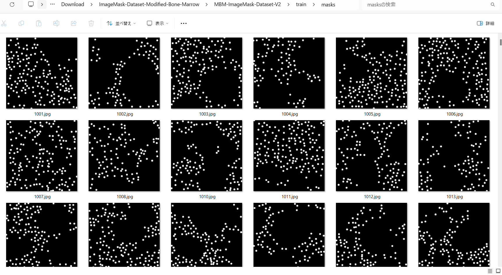
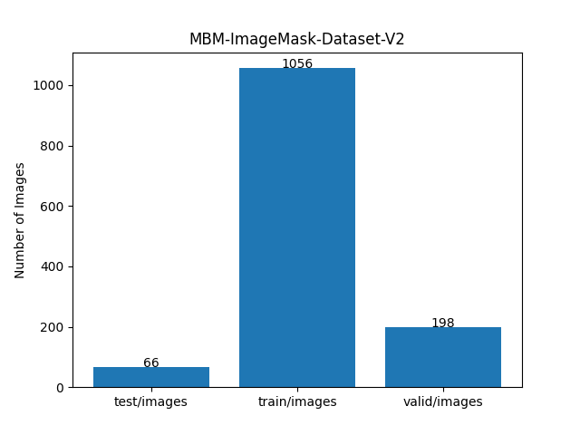

<h2>ImageMask-Dataset-Modified-Bone-Marrow-Cell (2024/09/20)</h2>

This is ImageMask Dataset for Modified-Bone-Marrow (MBM) Cell. 
The dataset used here has been taken from the github repository: 
<a href="https://github.com/ieee8023/countception/blob/master/MBM_data.zip">
MBM_data.zip
</a>
  
<b>Download ImageMask-Dataset</b> 
You can download our dataset from the google drive 
<a href="https://drive.google.com/file/d/1_1DuF9idDVu45f8D-CJuWFWckuADzQ-6/view?usp=sharing">
MBM-ImageMask-Dataset-V2.zip</a>
 

<h3>1. Dataset Citation</h3>
We used the following MBM_dataset to create our ImageMask Dataset: 

<a href="https://github.com/ieee8023/countception/blob/master/MBM_data.zip">
https://github.com/ieee8023/countception/blob/master/MBM_data.zip</a> 
 

Count-Ception: Counting by Fully Convolutional Redundant Counting (arXiv)
Joseph Paul Cohen, Genevieve Boucher, Craig A. Glastonbury, Henry Z. Lo, Yoshua Bengio

<a href="https://github.com/ieee8023/countception">https://github.com/ieee8023/countception</a>
 
<b>Citation request:</b> 
Count-ception: Counting by Fully Convolutional Redundant Counting 
JP Cohen, G Boucher, CA Glastonbury, HZ Lo, Y Bengio 
International Conference on Computer Vision (ICCV) Workshop on Bioimage Computing 

@inproceedings{Cohen2017, 
title = {Count-ception: Counting by Fully Convolutional Redundant Counting}, 
author = {Cohen, Joseph Paul and Boucher, Genevieve and Glastonbury, Craig A. and Lo, Henry Z. and Bengio, Yoshua}, 
booktitle = {International Conference on Computer Vision Workshop on BioImage Computing}, 
url = {http://arxiv.org/abs/1703.08710}, 
year = {2017} 
} 

<h3>2. ImageMaskDataset Generation</h3>
Please download the master MBM dataset from 
<a href="https://github.com/ieee8023/countception/blob/master/MBM_data.zip">
MBM_data.zip</a>, and expand it in your working directory.
It contains 44 image and 44 dots files of 600x600 pixels.  
 
 
Enlarged image and dots files. 
As shown below, the dots file contains center points of the cell nuclei, not an ordinary segmentation mask file.  
<table>
<tr>
<th>image file </th>
<th>dots file </th>

</tr>
<tr>
<td> </td>
<td> </td>

</tr>
</table>
 
Please run the following command for Python <a href="./ImageMaskDatasetGenerator.py">ImageMaskDatasetGenerator.py</a> 
 
<pre>
>python ImageMaskDatasetGenerator.py
</pre>
This generates 640x640 pixels image files, and segmentation mask files by drawing filled circles with a fixed radius around 
center points of the cell nuclei in the dots files,
 
This creates an augmented MBM-master-V2 dataset from MBM_data by using the offline augmentation tool ImageMaskDatasetGenerator.py. 
<pre>
./MBM-master-V2
├─images
└─masks
</pre>
<table>
<tr>
<th>image file </th>
<th>mask file </th>

</tr>
<tr>
<td> </td>
<td> </td>

</tr>
</table>

 
<h3>3. Split master</h3>

Please run the following command for Python <a href="./split_master.py">split_master.py</a> 
 
<pre>
>python split_master.py
</pre>
This creates MBM-ImageMask-Dataset-V2 from MBM-master-V2. 
<pre>
./MBM-ImageMask-Dataset-V2
├─test
│  ├─images
│  └─masks
├─train
│  ├─images
│  └─masks
└─valid
    ├─images
    └─masks
</pre>

<b>Train images sample</b> 
  
<b>Train mask sample</b> 
  

<b>Dataset Statistics</b>  
 
